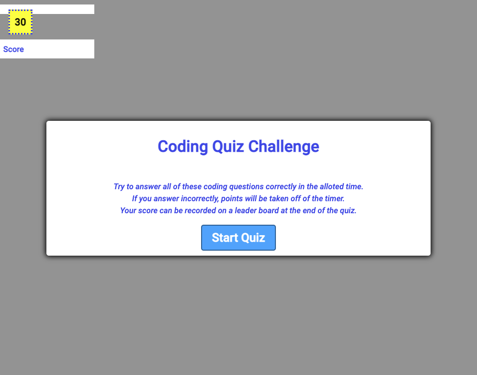

# Module-04-Challenge: Code Quiz

## Description

For this challenge assignment, I was tasked with creating a code quiz from scratch. The code quiz involves a "Start" button that initiates a timer. When the clock reaches zero, the quiz is over and the user is prompted to upload their score and initials to a leader board. If the user answers a question incorrectly, then some time is taken off of the quiz timer. When a question is answered, the correct answer is displayed in green and the incorrect answers are displayed in red. The user can restart the quiz once all of the questions are entered and they click the "Restart" button.

## Screenshot

## Link to deployed application:

https://sethdaulton.github.io/Module-04-Challenge/

